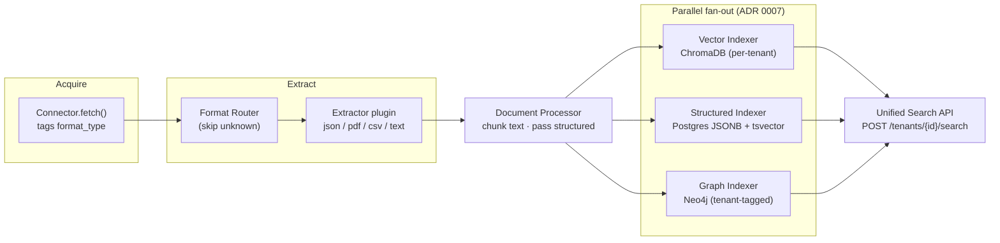

# DealPrep Ingestion & Retrieval Platform

A self-service, multi-tenant platform where a team onboards a data source by submitting a
config manifest (no code), and the system automatically acquires, extracts, chunks, and
indexes that data into **three stores** — a vector store (ChromaDB), a relational/structured
store (Postgres), and a knowledge graph (Neo4j) — then exposes it through one **unified
search API**. Every record is traceable to its source, and every store is isolated per tenant.

This repo covers Phases 1–7 of the [product vision](docs/PRD.md). Architecture decisions are
in [docs/adr/](docs/adr/); the detailed system diagram is in [docs/architecture.md](docs/architecture.md).

---

## Data flow



A single source record can yield **both** text documents (→ chunks → vectors + graph) and
structured records (→ Postgres). Example: a PDF's prose pages become embeddings while its
tables become structured rows.

## The three stores (platform data layer)

| Store | Role | Isolation | ADR |
|---|---|---|---|
| **Postgres** | operational metadata + structured records (JSONB) + keyword search (tsvector) | mandatory `tenant_id` filter on every query | [0003](docs/adr/0003-postgres-consolidated-relational-structured-store.md) |
| **ChromaDB** | text embeddings (local `all-MiniLM-L6-v2`) | one collection per tenant | [0005](docs/adr/0005-chromadb-vector-store.md) |
| **Neo4j** | entities + relationships | `tenant_id` property tag + single tenant-filtered query helper | [0006](docs/adr/0006-neo4j-property-based-tenant-tagging.md) |

---

## Pluggable strategies (a team chooses its own pipeline)

Every stage is a **registry of swappable backends** — a working local default plus POC stubs —
selected per tenant via a **pipeline profile**. `GET /capabilities` lists what's available
(real vs stub); `PUT /tenants/{id}/profile` sets a team's choices (stubs are rejected).

| Stage | Backends (✅ real / 🟡 stub) | Default | Choose via | Decision guide |
|---|---|---|---|---|
| Extractor (by `format_type`) | ✅ json, csv, text, html, pdf · 🟡 docx, xlsx, pptx | format-driven | the data's format | [ADR 0008](docs/adr/0008-extractor-selection-and-stub-pattern.md) |
| Chunking | ✅ section_aware, sentence_window, fixed_size · 🟡 semantic | section_aware | profile | [ADR 0009](docs/adr/0009-chunking-strategy-selection.md) |
| Embedding | ✅ minilm, hashing · 🟡 openai, bedrock | minilm | profile | [ADR 0010](docs/adr/0010-embedding-backend-selection.md) |
| Vector store | ✅ chroma, memory · 🟡 pgvector, qdrant | chroma | profile | [ADR 0011](docs/adr/0011-vector-store-selection.md) |

Each ADR is a **decision framework** — who owns the choice, when to revisit, and a selection
rule-of-thumb. The profile mechanism + governance is [ADR 0012](docs/adr/0012-per-tenant-pipeline-profile.md).
The `hashing` + `memory` + `fixed_size` combination runs the whole vector path with **zero
external dependencies** (no torch, no ChromaDB) — ideal for CI/POC.

> Adding a backend is one file + one decorator (`@register_chunker` / `@register_embedder` /
> `@register_vector_store`), exactly like connectors and extractors — no core change.

## Run it locally

**Prerequisites:** Python 3.11+, Docker Desktop.

```powershell
# 1. Python deps
python -m venv .venv
.\.venv\Scripts\python.exe -m pip install -r requirements.txt
.\.venv\Scripts\python.exe -m spacy download en_core_web_sm

# 2. Start Postgres + Neo4j (ChromaDB is embedded, no container)
docker compose up -d

# 3. Run the API (creates tables, discovers plugins, starts the scheduler)
.\.venv\Scripts\python.exe -m uvicorn app.main:app --port 8077
```

- API docs (OpenAPI): **http://127.0.0.1:8077/docs**
- Phase 1–4 onboarding console (UI): **http://127.0.0.1:8077/ui/**
- Neo4j browser: **http://localhost:7474** (neo4j / dealprep-graph)

**Optional:** set `DEALPREP_ANTHROPIC_API_KEY` to use Claude for relationship extraction;
without it, a deterministic rule-based extractor is used so the graph still populates.

**Prove the whole flow end to end** (registers tenants, ingests JSON + a PDF, searches all
three stores, checks isolation):

```powershell
.\.venv\Scripts\python.exe examples\e2e_pipeline.py
```

---

## Add a new connector (no core changes)

1. Create `connectors/my_source.py`.
2. Define a Pydantic config schema and subclass `BaseConnector`.
3. Decorate with `@register_connector("my_source")` and implement `test_connection()` and
   `fetch()` — returning records tagged with a `format_type`.

```python
# connectors/my_source.py
from pydantic import BaseModel
from app.registry import register_connector
from connectors.base import BaseConnector

class MyConfig(BaseModel):
    url: str

@register_connector("my_source")
class MyConnector(BaseConnector):
    config_schema = MyConfig
    def test_connection(self): ...
    def fetch(self, since):
        return [{"format_type": "json", "content": {"hello": "world"},
                 "original_file_reference": self.config.url}]
```

Restart — `"connector_type": "my_source"` is now a valid manifest. (See [ADR 0004](docs/adr/0004-plugin-registry-connectors-extractors.md).)

## Add a new extractor (no core changes)

1. Create `pipeline/extractors/my_format.py`.
2. Subclass `BaseExtractor`, decorate with `@register_extractor("my_format")`, and return an
   `ExtractionResult` of text documents and/or structured records.

```python
# pipeline/extractors/my_format.py
from pipeline.contracts import ExtractionResult, RawRecord, TextDocument
from pipeline.extractors.base import BaseExtractor
from pipeline.extractors.registry import register_extractor

@register_extractor("my_format")
class MyExtractor(BaseExtractor):
    def extract(self, raw: RawRecord) -> ExtractionResult:
        return ExtractionResult(text_documents=[
            TextDocument(text=str(raw.content), original_file_reference=raw.original_file_reference)
        ])
```

Restart — any connector that emits `format_type: "my_format"` now flows through your extractor.

---

## Search API

`POST /tenants/{tenant_id}/search` — runs vector, structured, and graph search in parallel and
returns them **separately labeled** (no merging/ranking yet — that is the future orchestration
agent's job). `tenant_id` is mandatory; an unknown tenant is rejected.

**Request**
```json
{ "query": "Why does Acme Corp trade at a premium?", "k": 5, "record_type": null }
```

**Response** (shape)
```json
{
  "tenant_id": "…",
  "query": "Why does Acme Corp trade at a premium?",
  "vector": [
    { "text": "Acme Corp's reported EBITDA includes related-party revenue…",
      "score": 0.74,
      "metadata": { "original_file_reference": "sample_deal.pdf", "section_type": "pdf_page" } }
  ],
  "structured": [
    { "fields": { "Company": "Acme Corp", "EV/EBITDA": "13.5", "Sponsor": "Falcon Capital" },
      "score": 0.09,
      "metadata": { "record_type": "pdf_table_row", "original_file_reference": "sample_deal.pdf" } }
  ],
  "graph": [
    { "subject": "Acme Corp", "relationship": "related_party_of", "object": "Falcon Capital",
      "object_type": "COMPANY", "file_ref": "sample_deal.pdf" }
  ],
  "warnings": []
}
```

Graph results appear when the query mentions an entity name known in the tenant's graph; the
API returns that entity's direct (1-hop) relationships.

---

## Project layout

```
app/            FastAPI app, config, models, runner, search, routers, llm client
connectors/     connector plugins (rest_api, file_upload) + registry
pipeline/
  contracts.py  RawRecord / ExtractionResult / TextDocument / StructuredRecord / Chunk
  extractors/   json, csv, text, pdf + registry  (add a file to extend)
  processor.py  DocumentProcessor + section-aware chunker
  router.py     FormatRouter
  indexing/     vector (ChromaDB), structured (Postgres), graph/ (Neo4j stack)
  orchestrator.py  chains all stages with parallel fan-out
docs/           PRD, ADRs (0001-0007), architecture.md, production-readiness reviews
examples/       sample PDF generator, REST stub, end-to-end test
```

See [docs/production-readiness/](docs/production-readiness/README.md) for the per-phase
"what breaks in production" reviews.

See [docs/evaluation/](docs/evaluation/README.md) for the per-stage evaluation runbooks
(correctness, quality metrics, performance benchmarks, isolation, and backend gate checklists)
that a new backend must pass before `implemented = True`.
