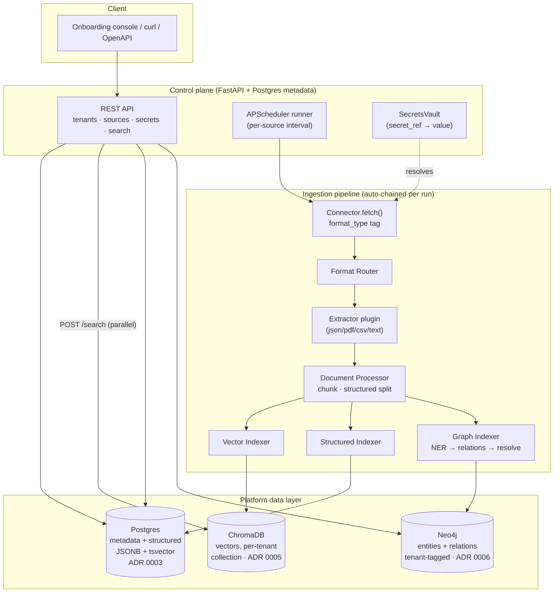

# Architecture

How the DealPrep ingestion + retrieval platform fits together, where the three data stores
sit, where tenant-isolation boundaries are enforced, and where each ADR's decision applies.

## System diagram

The three indexers run as a **parallel fan-out** ([ADR 0007](adr/0007-parallel-fanout-indexing.md));
the unified search API fans out to the three stores the same way and returns labeled,
un-merged results.

## Tenant isolation boundaries

Isolation is enforced **at each store**, not just at the API — a defense-in-depth posture
([ADR 0001](adr/0001-data-ingestion-onboarding-platform.md) D7, extended in Phase 5–6).

| Boundary | Mechanism | Enforced in |
|---|---|---|
| Raw landing | `data/{tenant_id}/...`, path-traversal guarded | `app/writer.py` (`TenantOutputWriter`) |
| Postgres (structured) | mandatory `tenant_id` filter on every read/write | `pipeline/indexing/structured.py` |
| ChromaDB (vectors) | one collection per tenant; no cross-tenant query path | `pipeline/indexing/vector.py` |
| Neo4j (graph) | `tenant_id` property on every node/edge; single tenant-filtered query helper | `pipeline/indexing/graph/neo4j_client.py` |
| Search API | `tenant_id` mandatory; unknown tenant rejected; never defaults to "all" | `app/routers/search.py` |

A request without a `tenant_id` is rejected outright at every layer; there is no code path
that reads across tenants.

## Where each ADR applies

| ADR | Decision | Applies at |
|---|---|---|
| [0001](adr/0001-data-ingestion-onboarding-platform.md) | Self-service ingestion (registration, manifests, dry-run, runner) | control plane + connectors |
| [0002](adr/0002-polyglot-language-allocation.md) | .NET-primary / Python-AI split (target) | whole-system language allocation |
| [0003](adr/0003-postgres-consolidated-relational-structured-store.md) | Postgres = metadata + structured (JSONB) + FTS (tsvector) | `app/models.py`, structured indexer |
| [0004](adr/0004-plugin-registry-connectors-extractors.md) | Registry/auto-discovery for connectors **and** extractors | `app/registry.py`, `pipeline/extractors/registry.py` |
| [0005](adr/0005-chromadb-vector-store.md) | ChromaDB, per-tenant collection, local embeddings | `pipeline/indexing/vector.py` |
| [0006](adr/0006-neo4j-property-based-tenant-tagging.md) | Neo4j property-based tenant tagging (Community) | `pipeline/indexing/graph/` |
| [0007](adr/0007-parallel-fanout-indexing.md) | Parallel fan-out indexing + per-stage logging | `pipeline/orchestrator.py`, `app/runner.py` |

## Traceability

Every artifact carries `tenant_id`, `source_id`, and `original_file_reference` end-to-end:
chunks (vector metadata), structured rows (columns), and graph nodes/edges (properties). A
search result can therefore always be traced back to the exact source document — a hard
requirement for the regulated-finance use case in the [PRD](PRD.md).

## Per-run observability

Each ingestion run writes a `run_history` row and one `run_stages` row per stage
(`extract`, `process`, `index_vector`, `index_structured`, `index_graph`), tagged by run and
tenant, so operators can see exactly where a run succeeded, was skipped, or failed — including
the partial-success states the parallel fan-out makes possible.
