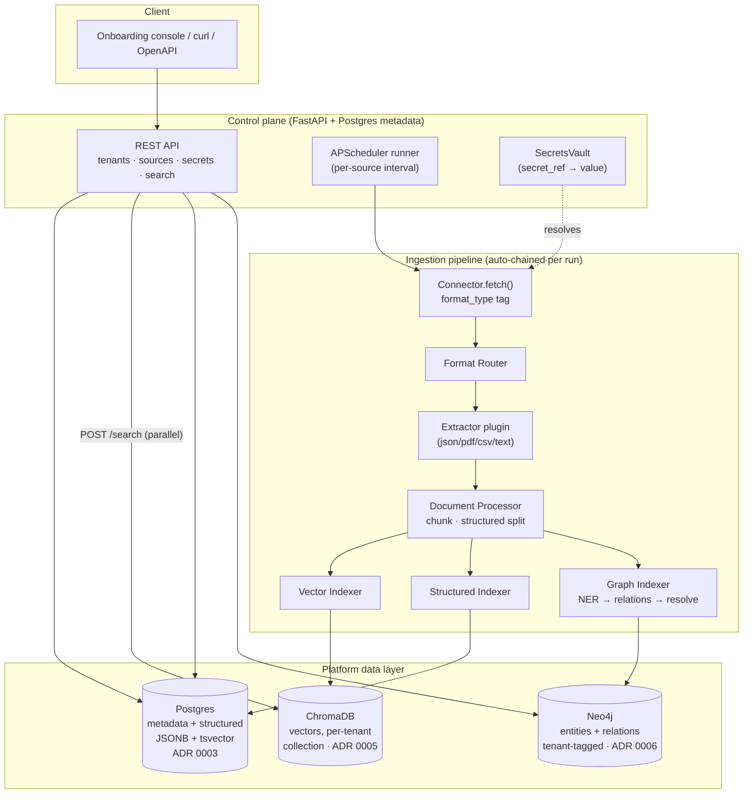

# Architecture

How the DealPrep ingestion + retrieval platform fits together, where the three data stores
sit, where tenant-isolation boundaries are enforced, and where each ADR's decision applies.

## System diagram

The three indexers run as a **parallel fan-out** ([ADR 0007](adr/0007-parallel-fanout-indexing.md));
the unified search API fans out to the three stores the same way and returns labeled,
un-merged results.

## Tenant isolation boundaries

Isolation is enforced **at each store**, not just at the API — a defense-in-depth posture
([ADR 0001](adr/0001-data-ingestion-onboarding-platform.md) D7, extended in Phase 5–6).

| Boundary | Mechanism | Enforced in |
|---|---|---|
| Raw landing | `data/{tenant_id}/...`, path-traversal guarded | `app/writer.py` (`TenantOutputWriter`) |
| Postgres (structured) | mandatory `tenant_id` filter on every read/write | `pipeline/indexing/structured.py` |
| ChromaDB (vectors) | one collection per tenant; no cross-tenant query path | `pipeline/indexing/vector.py` |
| Neo4j (graph) | `tenant_id` property on every node/edge; single tenant-filtered query helper | `pipeline/indexing/graph/neo4j_client.py` |
| Search API | `tenant_id` mandatory; unknown tenant rejected; never defaults to "all" | `app/routers/search.py` |

A request without a `tenant_id` is rejected outright at every layer; there is no code path
that reads across tenants.

## Where each ADR applies

| ADR | Decision | Applies at |
|---|---|---|
| [0001](adr/0001-data-ingestion-onboarding-platform.md) | Self-service ingestion (registration, manifests, dry-run, runner) | control plane + connectors |
| [0002](adr/0002-polyglot-language-allocation.md) | .NET-primary / Python-AI split (target) | whole-system language allocation |
| [0003](adr/0003-postgres-consolidated-relational-structured-store.md) | Postgres = metadata + structured (JSONB) + FTS (tsvector) | `app/models.py`, structured indexer |
| [0004](adr/0004-plugin-registry-connectors-extractors.md) | Registry/auto-discovery for connectors **and** extractors | `app/registry.py`, `pipeline/extractors/registry.py` |
| [0005](adr/0005-chromadb-vector-store.md) | ChromaDB, per-tenant collection, local embeddings | `pipeline/indexing/vector.py` |
| [0006](adr/0006-neo4j-property-based-tenant-tagging.md) | Neo4j property-based tenant tagging (Community) | `pipeline/indexing/graph/` |
| [0007](adr/0007-parallel-fanout-indexing.md) | Parallel fan-out indexing + per-stage logging | `pipeline/orchestrator.py`, `app/runner.py` |
| [0008](adr/0008-extractor-selection-and-stub-pattern.md) | Extractor selection + working-vs-stub pattern | `pipeline/extractors/` |
| [0009](adr/0009-chunking-strategy-selection.md) | Chunking strategy registry + selection guide | `pipeline/chunking/` |
| [0010](adr/0010-embedding-backend-selection.md) | Embedding backend registry + selection guide | `pipeline/embedding/` |
| [0011](adr/0011-vector-store-selection.md) | Vector store registry + selection guide | `pipeline/vectorstore/` |
| [0012](adr/0012-per-tenant-pipeline-profile.md) | Per-tenant pipeline profile (defaults + override) | `app/profiles.py`, `app/routers/profiles.py` |
| [0013](adr/0013-multi-agent-orchestration.md) | Multi-agent orchestration (fan-out/fan-in + synthesis) | `agents/`, `app/routers/analyze.py` |
| [0014](adr/0014-semantic-model-layer.md) | Semantic Model (Cortex Analyst equivalent) — NL→SQL with YAML metric/dimension contracts | `pipeline/semantic/`, `agents/semantic_model_agent.py` |
| [0015](adr/0015-safety-guardrails-layer.md) | Safety & Guardrails (Cortex Guard equivalent) — PII, injection, cost metering, audit log, RLS | `pipeline/guards/`, `app/routers/usage.py`, `app/routers/audit.py` |
| [0016](adr/0016-cost-saving-strategy.md) | Cost-saving strategy across all 7 layers — model routing, caching, dedup, eligibility checks | `app/llm.py`, `pipeline/cache/`, `pipeline/maintenance/` |
| [0017](adr/0017-agent-orchestration-evaluation.md) | Agent orchestration evaluation framework — 5-dimension OQS, golden dataset, CI eval suite | `tests/evaluation/`, `docs/evaluation/orchestration-evaluation.md` |
| [0018](adr/0018-analyst-dashboard.md) | Analyst Dashboard — Jinja2 + HTMX deal room UI, HITL panel, session history, usage view | `app/templates/`, `app/routers/ui.py` |
| [0019](adr/0019-observability-monitoring.md) | Observability — OTel traces, Prometheus metrics, structured logging, Grafana dashboards + alerts | `app/telemetry.py`, `app/metrics.py`, `monitoring/` |
| [0020](adr/0020-authentication-api-keys.md) | Authentication — API keys (SHA-256 hashed), session JWTs, tenant-scoped access, admin keys | `app/auth.py`, `app/routers/auth.py` |
| [0021](adr/0021-mcp-tool-exposure.md) | MCP Tool Exposure — standard tool protocol for Claude Desktop, LangGraph, external LLM hosts | `app/mcp_server.py`, `app/routers/mcp_tools.py` |

**Pluggable-strategy seam:** chunking, embedding, and vector store are each a name-keyed
registry (like connectors/extractors). A tenant's choices live in a validated
`TenantPipelineProfile`, resolved identically at index time (`runner` → `orchestrator`) and
query time (`search`/`inspect`) so vectors are always written and read with the same backend.
`GET /capabilities` advertises the menu (real vs stub).

## Traceability

Every artifact carries `tenant_id`, `source_id`, and `original_file_reference` end-to-end:
chunks (vector metadata), structured rows (columns), and graph nodes/edges (properties). A
search result can therefore always be traced back to the exact source document — a hard
requirement for the regulated-finance use case in the [PRD](PRD.md).

## Pipeline stage evaluation

Before any pluggable backend is marked `implemented = True`, it must pass the formal
evaluation defined in [`docs/evaluation/`](evaluation/README.md).
Each runbook covers correctness, quality metrics, performance benchmarks, isolation, and
failure modes for that stage. Eval results are recorded in a dated log appended to each
runbook.

| Stage | Evaluation runbook |
|---|---|
| Extractor | [extractor-evaluation.md](evaluation/extractor-evaluation.md) |
| Chunking | [chunking-evaluation.md](evaluation/chunking-evaluation.md) |
| Embedding | [embedding-evaluation.md](evaluation/embedding-evaluation.md) |
| Vector store | [vectorstore-evaluation.md](evaluation/vectorstore-evaluation.md) |

## Snowflake Cortex AI parity

See [`docs/cortex-ai-mapping.md`](cortex-ai-mapping.md) for the full component-by-component
mapping.  Overall coverage is **~72%** of Cortex AI's reference architecture as of Phase 7.

| Phase 8 priority | Gap | ADR |
|---|---|---|
| **Semantic query layer** | `StructuredAgent` does FTS only — no NL→SQL, no metric definitions | [ADR 0014](adr/0014-semantic-model-layer.md) |
| **Safety & guardrails** | No PII redaction, injection detection, cost metering, or audit log | [ADR 0015](adr/0015-safety-guardrails-layer.md) |

## Per-run observability

Each ingestion run writes a `run_history` row and one `run_stages` row per stage
(`extract`, `process`, `index_vector`, `index_structured`, `index_graph`), tagged by run and
tenant, so operators can see exactly where a run succeeded, was skipped, or failed — including
the partial-success states the parallel fan-out makes possible.
